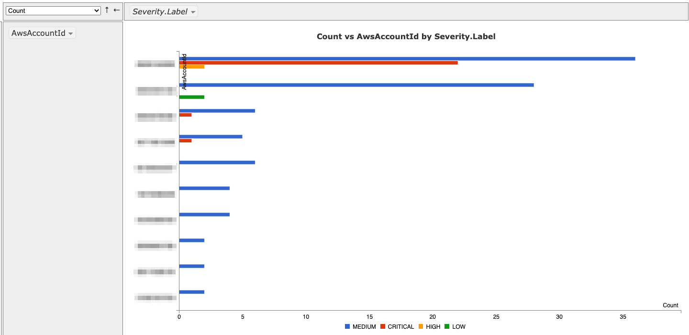

# securityhub-cli
Python CLI utility to quickly query SecurityHub across regions to export aggregate findings.

### Docker Install/Use
```
docker run -it securityhub-cli /app/securityhub-cli.py --help
```

### Running locally with AWS profiles
To run the utility inside docker but on a local system not in AWS, you'll need to pass additional environment variables and your AWS config/credentials as read-only to the container.  This is not necessary when running on instances hosted in AWS which leverage instance roles, etc.

```
docker run -e AWS_PROFILE={NAME OF PROFILE} -e AWS_CONFIG_FILE=/root/.aws/config -v ~/.aws/:/root/.aws/:ro -it securityhub-cli ./securityhub-cli.py --help
```

### Python Install Requirements
```
pip install -r requirements.txt
```

## Getting Started
```
python securityhub-cli.py --help
usage: securityhub-cli.py [-h] [--version] {get_findings,get_query} ...

AWS SecurityHub CLI: A user-friendly command-line client to query AWS
SecurityHub and export events or generate reports.

optional arguments:
  -h, --help            show this help message and exit
  --version             show program's version number and exit

actions:
  {get_findings,get_query}
                        sub-command help
    get_findings        Search SecurityHub findings using CLI filters.
    get_query           Query SecurityHub findings by providing your own
                        querystring (JSON querystring).
```

## get_findings
Use the currently available command arguments to build a Security Hub query dynamically. Limited argument support. 

```
python securityhub-cli.py get_findings --help
usage: securityhub-cli.py get_findings [-h] [-a] [--showquery]
                                       [-o [OUTPUTFILE]]
                                       [-f {JSON,JSONL,CSV,EXCEL,PIVOT,SUMMARY} [{JSON,JSONL,CSV,EXCEL,PIVOT,SUMMARY} ...]]
                                       [--loglevel {CRITICAL,ERROR,WARNING,INFO,DEBUG}]
                                       [-r REGION [REGION ...]]
                                       [-s Field SortOrder]
                                       [-i INSTANCEIDS [INSTANCEIDS ...]]
                                       [--ComplianceStatus {ACTIVE,ARCHIVED} [{ACTIVE,ARCHIVED} ...]]
                                       [--ProductName PRODUCTNAME [PRODUCTNAME ...]]
                                       [--RecordState {ACTIVE,ARCHIVED} [{ACTIVE,ARCHIVED} ...]]
                                       [--SeverityLabel {INFORMATIONAL,LOW,MEDIUM,HIGH,CRITICAL} [{INFORMATIONAL,LOW,MEDIUM,HIGH,CRITICAL} ...]]
                                       [-t RESOURCETAGS [RESOURCETAGS ...]]
                                       [--WorkflowStatus {NEW,NOTIFIED,SUPPRESSED,RESOVLVED} [{NEW,NOTIFIED,SUPPRESSED,RESOVLVED} ...]]
                                       [--DateField [{CreatedAt,FirstObservedAt,LastObservedAt,ThreatIntelIndicatorLastObservedAt,UpdatedAt}]]
                                       [-dates Start End | -days DAYS]

optional arguments:
  -h, --help            show this help message and exit
  -a, --autostop        Stop iterating regions once findings returned.
  --showquery           Show the query that is submitted to SecurityHub.
  -o [OUTPUTFILE], --outputfile [OUTPUTFILE]
                        Filename to write collected events.
  -f {JSON,JSONL,CSV,EXCEL,PIVOT,SUMMARY} [{JSON,JSONL,CSV,EXCEL,PIVOT,SUMMARY} ...], --format {JSON,JSONL,CSV,EXCEL,PIVOT,SUMMARY} [{JSON,JSONL,CSV,EXCEL,PIVOT,SUMMARY} ...]
                        Output format to write events into file [--filename].
  --loglevel {CRITICAL,ERROR,WARNING,INFO,DEBUG}
                        Modify logging verbosity.
  -r REGION [REGION ...], --Regions REGION [REGION ...], --Region REGION [REGION ...]
                        AWS region(s) to query (DEFAULT: All returned from EC2
                        describe_regions() API.).
  -s Field SortOrder, --SortCriteria Field SortOrder
                        Sort findings by a results field (e.g. SeverityLabel)
                        and order (asc|desc).

Finding Filters:
  Filter query by fields & values.

  -i INSTANCEIDS [INSTANCEIDS ...], --InstanceIds INSTANCEIDS [INSTANCEIDS ...]
                        An EC2 InstanceId value to collect associated
                        findings. (RECOMMENDATION: Enable --autostop)
  --ComplianceStatus {ACTIVE,ARCHIVED} [{ACTIVE,ARCHIVED} ...]
                        Finding status result of a check run against a
                        specific rule in a supported standard, such as CIS AWS
                        Foundations (DEFAULT: ['FAILED', 'WARNING']).
  --ProductName PRODUCTNAME [PRODUCTNAME ...]
                        SecurityHub product name (e.g. Inspector, GuardDuty)
  --RecordState {ACTIVE,ARCHIVED} [{ACTIVE,ARCHIVED} ...]
                        One or more RecordState values (DEFAULT: ACTIVE).
  --SeverityLabel {INFORMATIONAL,LOW,MEDIUM,HIGH,CRITICAL} [{INFORMATIONAL,LOW,MEDIUM,HIGH,CRITICAL} ...]
                        One or more SeverityLabel values.
  -t RESOURCETAGS [RESOURCETAGS ...], --tags RESOURCETAGS [RESOURCETAGS ...]
                        List of AWS resource tags & values to query.
  --WorkflowStatus {NEW,NOTIFIED,SUPPRESSED,RESOVLVED} [{NEW,NOTIFIED,SUPPRESSED,RESOVLVED} ...]

Date Filters:
  Filter query by timestamp fields.

  --DateField [{CreatedAt,FirstObservedAt,LastObservedAt,ThreatIntelIndicatorLastObservedAt,UpdatedAt}]
                        Select a timestamp field to filter findings (DEFAULT:
                        UpdatedAt).
  -dates Start End, --DateRangeFixed Start End
                        An ISO8601-formatted timestamps (required if
                        --DateField specified).
  -days DAYS, --DateRangeRelative DAYS
                        Filter since DAYS ago (DEFAULT: 90).
```

## get_query
Use if you already have a Security Hub JSON query (the "Filters" object, as a string...think single quotes!).

```
python securityhub-cli.py get_query --help
usage: securityhub-cli.py get_query [-h] [-a] [--showquery]
                                       [-o [OUTPUTFILE]]
                                       [-f {JSON,JSONL,CSV,PIVOT} [{JSON,JSONL,CSV,PIVOT} ...]]
                                       [--loglevel {CRITICAL,ERROR,WARNING,INFO,DEBUG}]
                                       [-r REGION [REGION ...]]
                                       [-s Field SortOrder]
                                       querystring

positional arguments:
  querystring           Accepts valid SecurityHub query as JSON.

optional arguments:
  -h, --help            show this help message and exit
  -a, --autostop        Stop iterating regions once findings returned.
  --showquery           Show the query that is submitted to SecurityHub.
  -o [OUTPUTFILE], --outputfile [OUTPUTFILE]
                        Filename to write collected events.
  -f {JSON,JSONL,CSV,PIVOT} [{JSON,JSONL,CSV,PIVOT} ...], --format {JSON,JSONL,CSV,PIVOT} [{JSON,JSONL,CSV,PIVOT} ...]
                        Output format to write events into file [--filename].
  --loglevel {CRITICAL,ERROR,WARNING,INFO,DEBUG}
                        Modify logging verbosity.
  -r REGION [REGION ...], --Regions REGION [REGION ...], --Region REGION [REGION ...]
                        AWS region(s) to query (DEFAULT: All returned from EC2
                        describe_regions() API.).
  -s Field SortOrder, --SortCriteria Field SortOrder
                        Sort findings by a results field (e.g. SeverityLabel)
                        and order (asc|desc).
```

# Examples

## Example1:
Query with pivot-table output.

```
python securityhub-cli.py get_findings \
    --outputfile \
    --format PIVOT \
    -days 7 \
    --showquery \
    -r us-east-1 us-east-2

2021-01-14 09:38:02,576 INFO     Started (1 of 2 REGIONS) SecurityHub query in REGION=us-east-1
2021-01-14 09:38:02,609 INFO     Found credentials in shared credentials file: ~/.aws/credentials
2021-01-14 09:44:25,433 INFO     Completed REGION=us-east-1 (1 of 2 REGIONS) REGIONAL_FINDINGS=78 TOTAL_FINDINGS=78
2021-01-14 09:44:25,433 INFO     Started (2 of 2 REGIONS) SecurityHub query in REGION=us-east-2
2021-01-14 09:44:30,211 INFO     Completed REGION=us-east-2 (2 of 2 REGIONS) REGIONAL_FINDINGS=70 TOTAL_FINDINGS=148
2021-01-14 09:44:30,211 INFO     Completed SecurityHub collection TOTAL_FINDINGS=148
2021-01-14 09:44:30,212 INFO     SecurityHub Query FILTER={'UpdatedAt': [{'DateRange': {'Value': 7, 'Unit': 'DAYS'}}]}
2021-01-14 09:44:30,264 INFO     Completed writing to OUTPUTFILE=securityhub-get_findings-2021-01-14T14-38-02Z.html FORMAT=PIVOT
```



## Example2:
Run a search (get_findings) for findings with resources tagged by "Name", in 2 regions, in JSON format output to 'findings-prod.json', AND "Auto-Stop" (stops on first region where findings returned):
```
python securityhub-cli.py get_findings \
    --tags Name=web-server \
    --Regions us-east-1 us-east-2 \
    --outputfile=findings-prod.json \
    --format=JSON \
    --autostop

2021-01-12 19:09:51,229 INFO     Started (1 of 2 REGIONS) SecurityHub query in REGION=us-east-1
2021-01-12 19:09:51,272 INFO     Found credentials in shared credentials file: ~/.aws/credentials
2021-01-12 19:09:51,845 INFO     Completed SecurityHub collection TOTAL_FINDINGS=52
2021-01-12 19:09:51,854 INFO     Completed writing to OUTPUTFILE=findings-prod.json FORMAT=JSON
```

## Example3:
Get GuardDuty findings updated in last 7days across all regions
```
python securityhub-cli.py get_findings \
    --outputfile \
    --format=CSV \
    --ProductName GuardDuty \
    --RecordState ACTIVE \
    --DateField \
    --DateRangeRelative=7
    
2021-01-13 10:15:28,802 INFO     Found credentials in shared credentials file: ~/.aws/credentials
2021-01-13 10:15:29,161 INFO     Started (1 of 16 REGIONS) SecurityHub query in REGION=eu-north-1
2021-01-13 10:15:29,926 INFO     Completed REGION=eu-north-1 (1 of 16 REGIONS) REGIONAL_FINDINGS=0 TOTAL_FINDINGS=0
2021-01-13 10:15:29,926 INFO     Started (2 of 16 REGIONS) SecurityHub query in REGION=ap-south-1
2021-01-13 10:15:31,060 INFO     Completed REGION=ap-south-1 (2 of 16 REGIONS) REGIONAL_FINDINGS=0 TOTAL_FINDINGS=0
2021-01-13 10:15:31,060 INFO     Started (3 of 16 REGIONS) SecurityHub query in REGION=eu-west-3
2021-01-13 10:15:31,795 INFO     Completed REGION=eu-west-3 (3 of 16 REGIONS) REGIONAL_FINDINGS=0 TOTAL_FINDINGS=0
2021-01-13 10:15:31,795 INFO     Started (4 of 16 REGIONS) SecurityHub query in REGION=eu-west-2
2021-01-13 10:15:32,494 INFO     Completed REGION=eu-west-2 (4 of 16 REGIONS) REGIONAL_FINDINGS=0 TOTAL_FINDINGS=0
2021-01-13 10:15:32,494 INFO     Started (5 of 16 REGIONS) SecurityHub query in REGION=eu-west-1
2021-01-13 10:15:33,175 INFO     Completed REGION=eu-west-1 (5 of 16 REGIONS) REGIONAL_FINDINGS=0 TOTAL_FINDINGS=0
2021-01-13 10:15:33,175 INFO     Started (6 of 16 REGIONS) SecurityHub query in REGION=ap-northeast-2
2021-01-13 10:15:34,377 INFO     Completed REGION=ap-northeast-2 (6 of 16 REGIONS) REGIONAL_FINDINGS=0 TOTAL_FINDINGS=0
2021-01-13 10:15:34,377 INFO     Started (7 of 16 REGIONS) SecurityHub query in REGION=ap-northeast-1
2021-01-13 10:15:35,389 INFO     Completed REGION=ap-northeast-1 (7 of 16 REGIONS) REGIONAL_FINDINGS=2 TOTAL_FINDINGS=2
2021-01-13 10:15:35,389 INFO     Started (8 of 16 REGIONS) SecurityHub query in REGION=sa-east-1
2021-01-13 10:15:36,334 INFO     Completed REGION=sa-east-1 (8 of 16 REGIONS) REGIONAL_FINDINGS=0 TOTAL_FINDINGS=2
2021-01-13 10:15:36,334 INFO     Started (9 of 16 REGIONS) SecurityHub query in REGION=ca-central-1
2021-01-13 10:15:36,778 INFO     Completed REGION=ca-central-1 (9 of 16 REGIONS) REGIONAL_FINDINGS=2 TOTAL_FINDINGS=4
2021-01-13 10:15:36,778 INFO     Started (10 of 16 REGIONS) SecurityHub query in REGION=ap-southeast-1
2021-01-13 10:15:40,746 ERROR    Could not connect to the endpoint URL: "https://securityhub.ap-southeast-1.amazonaws.com/findings"
2021-01-13 10:15:40,746 INFO     Started (11 of 16 REGIONS) SecurityHub query in REGION=ap-southeast-2
2021-01-13 10:15:41,751 INFO     Completed REGION=ap-southeast-2 (11 of 16 REGIONS) REGIONAL_FINDINGS=0 TOTAL_FINDINGS=4
2021-01-13 10:15:41,751 INFO     Started (12 of 16 REGIONS) SecurityHub query in REGION=eu-central-1
2021-01-13 10:15:42,785 INFO     Completed REGION=eu-central-1 (12 of 16 REGIONS) REGIONAL_FINDINGS=3 TOTAL_FINDINGS=7
2021-01-13 10:15:42,785 INFO     Started (13 of 16 REGIONS) SecurityHub query in REGION=us-east-1
2021-01-13 10:15:43,246 INFO     Completed REGION=us-east-1 (13 of 16 REGIONS) REGIONAL_FINDINGS=4 TOTAL_FINDINGS=11
2021-01-13 10:15:43,246 INFO     Started (14 of 16 REGIONS) SecurityHub query in REGION=us-east-2
2021-01-13 10:15:43,691 INFO     Completed REGION=us-east-2 (14 of 16 REGIONS) REGIONAL_FINDINGS=0 TOTAL_FINDINGS=11
2021-01-13 10:15:43,691 INFO     Started (15 of 16 REGIONS) SecurityHub query in REGION=us-west-1
2021-01-13 10:15:44,281 INFO     Completed REGION=us-west-1 (15 of 16 REGIONS) REGIONAL_FINDINGS=0 TOTAL_FINDINGS=11
2021-01-13 10:15:44,282 INFO     Started (16 of 16 REGIONS) SecurityHub query in REGION=us-west-2
2021-01-13 10:15:44,915 INFO     Completed REGION=us-west-2 (16 of 16 REGIONS) REGIONAL_FINDINGS=0 TOTAL_FINDINGS=11
2021-01-13 10:15:44,915 INFO     Completed SecurityHub collection TOTAL_FINDINGS=11
2021-01-13 10:15:44,935 INFO     Completed writing to OUTPUTFILE=securityhub-get_findings-2021-01-13T15-15-28Z.csv FORMAT=CSV
``` 

## Example4:
Run a search (get_findings) for findings within last 90days by one or more InstanceIds (in unknown account and/or region):
```
python securityhub-cli.py get_findings \
    --InstanceId i-0d1e6d82k28fdokl3 i-0k28fk38fk993kdfa i-082398jkkn18324as \
    --DateRangeRelative=90

2021-01-12 18:51:09,695 INFO     Found credentials in shared credentials file: ~/.aws/credentials
2021-01-12 18:51:10,074 INFO     Started INSTANCEID=i-0d1e6d82k28fdokl3 (1 of 3) REGION=eu-north-1 (1 of 16)
2021-01-12 18:51:11,551 INFO     Started INSTANCEID=i-0d1e6d82k28fdokl3 (1 of 3) REGION=ap-south-1 (2 of 16)
2021-01-12 18:51:14,245 INFO     Started INSTANCEID=i-0d1e6d82k28fdokl3 (1 of 3) REGION=eu-west-3 (3 of 16)
2021-01-12 18:51:15,592 INFO     Started INSTANCEID=i-0d1e6d82k28fdokl3 (1 of 3) REGION=eu-west-2 (4 of 16)
2021-01-12 18:51:16,878 INFO     Started INSTANCEID=i-0d1e6d82k28fdokl3 (1 of 3) REGION=eu-west-1 (5 of 16)
2021-01-12 18:51:18,501 INFO     Started INSTANCEID=i-0d1e6d82k28fdokl3 (1 of 3) REGION=ap-northeast-2 (6 of 16)
2021-01-12 18:51:20,825 INFO     Started INSTANCEID=i-0d1e6d82k28fdokl3 (1 of 3) REGION=ap-northeast-1 (7 of 16)
2021-01-12 18:51:22,791 INFO     Started INSTANCEID=i-0d1e6d82k28fdokl3 (1 of 3) REGION=sa-east-1 (8 of 16)
2021-01-12 18:51:24,452 INFO     Started INSTANCEID=i-0d1e6d82k28fdokl3 (1 of 3) REGION=ca-central-1 (9 of 16)
2021-01-12 18:51:25,202 INFO     Started INSTANCEID=i-0d1e6d82k28fdokl3 (1 of 3) REGION=ap-southeast-1 (10 of 16)
2021-01-12 18:51:31,590 ERROR    Could not connect to the endpoint URL: "https://securityhub.ap-southeast-1.amazonaws.com/members?OnlyAssociated=true&MaxResults=50&NextToken="
2021-01-12 18:51:31,590 INFO     Started INSTANCEID=i-0d1e6d82k28fdokl3 (1 of 3) REGION=ap-southeast-2 (11 of 16)
2021-01-12 18:51:33,723 INFO     Started INSTANCEID=i-0d1e6d82k28fdokl3 (1 of 3) REGION=eu-central-1 (12 of 16)
2021-01-12 18:51:35,096 INFO     Started INSTANCEID=i-0d1e6d82k28fdokl3 (1 of 3) REGION=us-east-1 (13 of 16)
2021-01-12 18:51:37,267 INFO     Completed INSTANCEID=i-0d1e6d82k28fdokl3 (1 of 3) INSTANCE_FINDINGS=97 TOTAL_FINDINGS=97
2021-01-12 18:51:37,267 INFO     Started INSTANCEID=i-0k28fk38fk993kdfa (2 of 3) REGION=eu-north-1 (1 of 16)
2021-01-12 18:51:38,719 INFO     Started INSTANCEID=i-0k28fk38fk993kdfa (2 of 3) REGION=ap-south-1 (2 of 16)
2021-01-12 18:51:41,429 INFO     Started INSTANCEID=i-0k28fk38fk993kdfa (2 of 3) REGION=eu-west-3 (3 of 16)
2021-01-12 18:51:42,673 INFO     Started INSTANCEID=i-0k28fk38fk993kdfa (2 of 3) REGION=eu-west-2 (4 of 16)
2021-01-12 18:51:43,823 INFO     Started INSTANCEID=i-0k28fk38fk993kdfa (2 of 3) REGION=eu-west-1 (5 of 16)
2021-01-12 18:51:45,116 INFO     Started INSTANCEID=i-0k28fk38fk993kdfa (2 of 3) REGION=ap-northeast-2 (6 of 16)
2021-01-12 18:51:47,290 INFO     Started INSTANCEID=i-0k28fk38fk993kdfa (2 of 3) REGION=ap-northeast-1 (7 of 16)
2021-01-12 18:51:49,237 INFO     Started INSTANCEID=i-0k28fk38fk993kdfa (2 of 3) REGION=sa-east-1 (8 of 16)
2021-01-12 18:51:50,837 INFO     Started INSTANCEID=i-0k28fk38fk993kdfa (2 of 3) REGION=ca-central-1 (9 of 16)
2021-01-12 18:51:51,747 INFO     Started INSTANCEID=i-0k28fk38fk993kdfa (2 of 3) REGION=ap-southeast-1 (10 of 16)
2021-01-12 18:52:01,224 ERROR    Could not connect to the endpoint URL: "https://securityhub.ap-southeast-1.amazonaws.com/members?OnlyAssociated=true&MaxResults=50&NextToken="
2021-01-12 18:52:01,224 INFO     Started INSTANCEID=i-0k28fk38fk993kdfa (2 of 3) REGION=ap-southeast-2 (11 of 16)
2021-01-12 18:52:03,618 INFO     Started INSTANCEID=i-0k28fk38fk993kdfa (2 of 3) REGION=eu-central-1 (12 of 16)
2021-01-12 18:52:05,113 INFO     Started INSTANCEID=i-0k28fk38fk993kdfa (2 of 3) REGION=us-east-1 (13 of 16)
2021-01-12 18:52:05,871 INFO     Started INSTANCEID=i-0k28fk38fk993kdfa (2 of 3) REGION=us-east-2 (14 of 16)
2021-01-12 18:52:06,738 INFO     Started INSTANCEID=i-0k28fk38fk993kdfa (2 of 3) REGION=us-west-1 (15 of 16)
2021-01-12 18:52:07,940 INFO     Started INSTANCEID=i-0k28fk38fk993kdfa (2 of 3) REGION=us-west-2 (16 of 16)
2021-01-12 18:52:11,346 INFO     Completed INSTANCEID=i-0k28fk38fk993kdfa (2 of 3) INSTANCE_FINDINGS=0 TOTAL_FINDINGS=97
2021-01-12 18:52:11,346 INFO     Started INSTANCEID=i-082398jkkn18324as (3 of 3) REGION=eu-north-1 (1 of 16)
2021-01-12 18:52:12,796 INFO     Started INSTANCEID=i-082398jkkn18324as (3 of 3) REGION=ap-south-1 (2 of 16)
2021-01-12 18:52:15,757 INFO     Started INSTANCEID=i-082398jkkn18324as (3 of 3) REGION=eu-west-3 (3 of 16)
2021-01-12 18:52:17,241 INFO     Started INSTANCEID=i-082398jkkn18324as (3 of 3) REGION=eu-west-2 (4 of 16)
2021-01-12 18:52:18,469 INFO     Started INSTANCEID=i-082398jkkn18324as (3 of 3) REGION=eu-west-1 (5 of 16)
2021-01-12 18:52:19,753 INFO     Started INSTANCEID=i-082398jkkn18324as (3 of 3) REGION=ap-northeast-2 (6 of 16)
2021-01-12 18:52:21,985 INFO     Started INSTANCEID=i-082398jkkn18324as (3 of 3) REGION=ap-northeast-1 (7 of 16)
2021-01-12 18:52:24,069 INFO     Started INSTANCEID=i-082398jkkn18324as (3 of 3) REGION=sa-east-1 (8 of 16)
2021-01-12 18:52:25,797 INFO     Started INSTANCEID=i-082398jkkn18324as (3 of 3) REGION=ca-central-1 (9 of 16)
2021-01-12 18:52:26,508 INFO     Started INSTANCEID=i-082398jkkn18324as (3 of 3) REGION=ap-southeast-1 (10 of 16)
2021-01-12 18:52:35,418 ERROR    Could not connect to the endpoint URL: "https://securityhub.ap-southeast-1.amazonaws.com/members?OnlyAssociated=true&MaxResults=50&NextToken="
2021-01-12 18:52:35,418 INFO     Started INSTANCEID=i-082398jkkn18324as (3 of 3) REGION=ap-southeast-2 (11 of 16)
2021-01-12 18:52:37,516 INFO     Started INSTANCEID=i-082398jkkn18324as (3 of 3) REGION=eu-central-1 (12 of 16)
2021-01-12 18:52:38,777 INFO     Started INSTANCEID=i-082398jkkn18324as (3 of 3) REGION=us-east-1 (13 of 16)
2021-01-12 18:52:39,795 INFO     Completed INSTANCEID=i-082398jkkn18324as (3 of 3) INSTANCE_FINDINGS=5 TOTAL_FINDINGS=102
2021-01-12 18:52:39,795 INFO     Completed SecurityHub collection TOTAL_FINDINGS=102
```

## Example5:
Query using your own "Filters" object (see https://docs.aws.amazon.com/securityhub/1.0/APIReference/API_GetFindings.html).
```
python securityhub-cli.py get_query \
  '{"RecordState":[{"Value":"ACTIVE","Comparison":"EQUALS"}],"ResourceAwsEc2InstanceVpcId":[{"Comparison":"EQUALS","Value":"vpc-xxxxxxxxxxxxxxxxx"}]}' \
  --outputfile -r us-east-1

2021-03-09 16:22:50,030 INFO     Validated QUERYSTRING as JSON!
2021-03-09 16:22:50,030 INFO     SecurityHub Query FILTER={'RecordState': [{'Value': 'ACTIVE', 'Comparison': 'EQUALS'}], 'ResourceAwsEc2InstanceVpcId': [{'Comparison': 'EQUALS', 'Value': 'vpc-xxxxxxxxxxxxxxxxx'}]}
2021-03-09 16:22:50,030 INFO     Started (1 of 1 REGIONS) SecurityHub query in REGION=us-east-1
2021-03-09 16:22:50,052 INFO     Found credentials in shared credentials file: ~/.aws/credentials
2021-03-09 16:22:50,623 INFO     Completed REGION=us-east-1 (1 of 1 REGIONS) REGIONAL_FINDINGS=18 TOTAL_FINDINGS=18
2021-03-09 16:22:50,624 INFO     Completed SecurityHub collection TOTAL_FINDINGS=18
2021-03-09 16:22:50,626 INFO     Completed writing to OUTPUTFILE=securityhub-get_query-2021-03-09T21-22-50Z.json FORMAT=JSON
```

# SecurityHub API Caveats
The following throttling limits apply to using Security Hub API operations.

`` BatchEnableStandards `` - RateLimit of 1 request per second, BurstLimit of 1 request per second.
`` GetFindings `` - RateLimit of 3 requests per second. BurstLimit of 6 requests per second.
`` UpdateFindings `` - RateLimit of 1 request per second. BurstLimit of 5 requests per second.
`` UpdateStandardsControl `` - RateLimit of 1 request per second, BurstLimit of 5 requests per second.
All other operations - RateLimit of 10 requests per second. BurstLimit of 30 requests per second.
